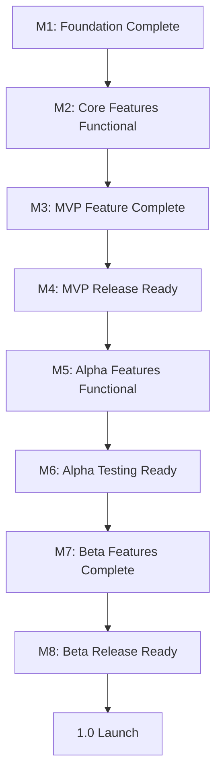

# Pond Conspiracy - Milestone Plan

**Project**: Pond Conspiracy
**Date**: 2025-12-13
**Version**: 1.0
**Timeline**: 10-12 weeks to MVP, 7-9 months to 1.0 Launch

---

## Overview

**Total Milestones**: 8 (4 MVP, 2 Alpha, 2 Beta)
**Release Phases**: MVP (Weeks 0-12) → Alpha (Months 1-3) → Beta (Months 4-6) → 1.0 (Month 7-9)
**Critical Path**: M1 → M2 → M3 → M4 (MVP) → M5 → M6 (Alpha) → M7 → M8 (Beta)

---

## 🔴 MVP Milestones (Early Access - Weeks 0-12)

### M1: Foundation Complete (Week 0-3)
**Release Phase**: MVP
**Target Date**: Week 3 (Day 21)
**Status**: Pending

**Description**: Infrastructure, combat foundation, conspiracy board prototype validated

**Epics In Scope**:
- EPIC-001: Combat System Foundation
- EPIC-002: BulletUpHell Integration
- EPIC-003: Conspiracy Board UI (Figma prototype only)

**Key Deliverables**:
- ✅ Combat feels good: 60fps, <16ms input lag, responsive controls
- ✅ Movement (WASD 8-dir) + tongue attack working
- ✅ Enemy spawning functional (2 enemy types)
- ✅ BulletUpHell plugin forked and integrated
- ✅ Figma conspiracy board prototype created
- ✅ 10 target users tested prototype (8/10 satisfaction achieved)
- ✅ Performance validated: 60fps minimum on GTX 1060

**Success Criteria**:
- [ ] Internal playtest: "Does combat feel good?" → YES
- [ ] Figma prototype satisfaction: 8/10 or higher
- [ ] Performance: 60fps stable during 500 enemies
- [ ] Input lag: <16ms measured with high-speed camera
- [ ] No crashes during 30-minute playtest

**Dependencies**:
- None (foundation milestone)

**Risks**:
- 🔴 **HIGH RISK**: Combat feel is subjective, may require iteration
- 🟡 **MEDIUM RISK**: Figma prototype satisfaction <8/10 blocks coding

**Mitigation**:
- Daily playtests with fresh eyes
- Iterate on Figma prototype until 8/10 achieved before coding

---

### M2: Core Features Functional (Week 4-7)
**Release Phase**: MVP
**Target Date**: Week 7 (Day 49)
**Status**: Pending

**Description**: Combat + Conspiracy Board + Mutations working end-to-end

**Epics In Scope**:
- EPIC-003: Conspiracy Board UI (implementation)
- EPIC-004: Environmental Data Content
- EPIC-005: Pollution Index UI
- EPIC-006: Mutation System

**Key Deliverables**:
- ✅ Conspiracy board implemented (drag-drop, Bezier strings, TL;DR/full-text)
- ✅ 7 data logs written, NGO-reviewed, integrated
- ✅ Pollution index UI functional on HUD
- ✅ 10 mutations implemented with 3 synergies
- ✅ Level-up choice UI working
- ✅ Core loop functional: Combat → Death → Investigation → Repeat

**Success Criteria**:
- [ ] Can play full run: combat → die → unlock evidence → read on board
- [ ] Conspiracy board UX satisfaction: 8/10 (validated with 10 users)
- [ ] All 7 data logs cite peer-reviewed studies
- [ ] NGO approval received for environmental content
- [ ] Pollution index updates correctly based on mutations
- [ ] No UI bugs (drag-drop, string rendering)

**Dependencies**:
- M1 (Combat foundation must exist)
- NGO partnership established (Week 0-1)

**Risks**:
- 🔴 **HIGH RISK**: Conspiracy board UX may not hit 8/10 satisfaction
- 🟡 **MEDIUM RISK**: NGO review delays content approval
- 🟡 **MEDIUM RISK**: Bezier string physics performance issues

**Mitigation**:
- User test conspiracy board implementation early (Week 5)
- Start NGO outreach in Week 0, build buffer time
- Profile string rendering, use object pooling if needed

---

### M3: MVP Feature Complete (Week 8-10)
**Release Phase**: MVP
**Target Date**: Week 10 (Day 70)
**Status**: Pending

**Description**: All MVP features implemented, ready for polish

**Epics In Scope**:
- EPIC-007: Boss Encounters
- EPIC-008: Meta-Progression System
- EPIC-009: Save System & Steam Cloud
- EPIC-010: Platform Support & Steam Integration

**Key Deliverables**:
- ✅ 2 boss fights implemented (The Lobbyist, The CEO)
- ✅ 2 informants unlockable
- ✅ Persistent conspiracy board state across runs
- ✅ Save/load system with Steam Cloud sync
- ✅ Windows + Linux builds working
- ✅ Steam Deck validated (55fps @ 800p)
- ✅ Steam achievements framework integrated

**Success Criteria**:
- [ ] Can complete full playthrough to one ending
- [ ] Boss fights feel challenging but fair
- [ ] Saves persist across runs, no corruption
- [ ] Steam Cloud sync working (tested on 2 PCs)
- [ ] Steam Deck playable with controller
- [ ] Performance: 60fps minimum on GTX 1060, 55fps on Steam Deck

**Dependencies**:
- M2 (Combat + Conspiracy Board must be functional)
- Steam partner access (Week 0)

**Risks**:
- 🔴 **HIGH RISK**: Boss fight difficulty tuning is time-consuming
- 🟡 **MEDIUM RISK**: Steam Deck performance may require optimization
- 🟡 **MEDIUM RISK**: Save corruption bugs are hard to reproduce

**Mitigation**:
- Design boss patterns on paper first, iterate in code
- Profile on Steam Deck early (Week 8)
- Write comprehensive save/load unit tests

---

### M4: MVP Release Ready (Week 11-12)
**Release Phase**: MVP (Early Access Launch)
**Target Date**: Week 12 (Day 84)
**Status**: Pending

**Description**: Polished, tested, bug-free Early Access release

**Epics In Scope**:
- EPIC-011: Accessibility Features
- All MVP epics (polish pass)

**Key Deliverables**:
- ✅ 3 colorblind modes implemented (Deuteranopia, Protanopia, Tritanopia)
- ✅ Text scaling (3 sizes)
- ✅ Screen shake toggle
- ✅ Rebindable controls
- ✅ All critical bugs fixed (crashes, soft-locks, save corruption)
- ✅ 15+ target users playtested
- ✅ Steam page finalized (trailer, screenshots, description)
- ✅ Early Access launch ($10)

**Success Criteria**:
- [ ] Zero critical bugs (crashes, save corruption, soft-locks)
- [ ] 80%+ positive reviews target set (85% aspirational)
- [ ] Accessibility: WCAG AA compliance validated
- [ ] Performance: 60fps minimum on GTX 1060 (90fps+ average)
- [ ] Playtester feedback: "This is fun and unique"
- [ ] Steam Deck: Verified badge achieved

**Dependencies**:
- M3 (All features must be complete)
- Steam partner agreement finalized

**Risks**:
- 🔴 **HIGH RISK**: Critical bugs discovered during final testing
- 🟡 **MEDIUM RISK**: Steam review process delays launch
- 🟡 **MEDIUM RISK**: Performance regression in final build

**Mitigation**:
- Start playtesting in Week 9, build bug fix buffer
- Submit Steam build 1 week before launch date
- Lock codebase Week 11 (no new features), polish only

---

## 🟠 Alpha Milestones (Month 1-3 Post-MVP)

### M5: Alpha Features Functional (Month 1-2)
**Release Phase**: Alpha
**Target Date**: Month 2 (60 days post-MVP)
**Status**: Pending

**Description**: Content expansion features implemented

**Epics In Scope**:
- EPIC-012: Third Boss Fight (The Researcher)
- EPIC-013: Second Ending Path
- EPIC-014: Additional Mutations (15 Total)
- EPIC-015: Visual Mutation Effects

**Key Deliverables**:
- ✅ 3rd boss fight implemented (The Researcher)
- ✅ 2nd ending path (government conspiracy variant)
- ✅ +5 mutations (15 total)
- ✅ +3 synergies (6 total)
- ✅ Frog visual changes based on mutations

**Success Criteria**:
- [ ] 3rd boss feels unique (different from Lobbyist/CEO)
- [ ] 2nd ending path discovered by <50% of players (good secret)
- [ ] New mutations balanced with existing ones
- [ ] Visual mutation effects don't impact performance
- [ ] Early Access reviews remain 80%+ positive

**Dependencies**:
- M4 (MVP launched, player feedback collected)

**Risks**:
- 🟡 **MEDIUM RISK**: Scope creep from player feedback
- 🟡 **MEDIUM RISK**: Visual mutation effects cause performance issues

**Mitigation**:
- Strict Alpha scope: only planned features, not player requests
- Profile visual mutations early, optimize rendering

---

### M6: Alpha Testing Ready (Month 3)
**Release Phase**: Alpha
**Target Date**: Month 3 (90 days post-MVP)
**Status**: Pending

**Description**: Alpha content polished, ready for player testing

**Epics In Scope**:
- EPIC-016: Dynamic Music System
- All Alpha epics (polish pass)

**Key Deliverables**:
- ✅ Dynamic music system (crossfades based on intensity)
- ✅ Boss dialogue samples (corporate-speak tone established)
- ✅ Alpha content tested by Early Access players
- ✅ Performance validated with new features

**Success Criteria**:
- [ ] Music crossfades smoothly (no pops/clicks)
- [ ] Boss dialogue adds to satire (player feedback positive)
- [ ] Performance: still 60fps minimum with all Alpha features
- [ ] Early Access reviews: 80%+ positive maintained
- [ ] Wishlist conversion: 20%+ (industry avg: 10-15%)

**Dependencies**:
- M5 (Alpha features must be functional)

**Risks**:
- 🟡 **MEDIUM RISK**: Dynamic music system complex to implement
- 🟡 **MEDIUM RISK**: Player feedback requests scope changes

**Mitigation**:
- Use simple crossfade algorithm (linear), no advanced DSP
- Log all feedback, triage for Beta/Post-Launch

---

## 🟡 Beta Milestones (Month 4-6 Pre-1.0)

### M7: Beta Features Complete (Month 4-5)
**Release Phase**: Beta
**Target Date**: Month 5 (150 days post-MVP)
**Status**: Pending

**Description**: All planned content implemented

**Epics In Scope**:
- EPIC-017: Secret Boss (Sentient Pond)
- EPIC-018: Third Ending Path (Nihilist)
- EPIC-019: Daily Challenges & Leaderboards
- EPIC-020: Endless Mode

**Key Deliverables**:
- ✅ Secret boss implemented (Sentient Pond)
- ✅ 3rd ending path (nihilist variant)
- ✅ Daily challenges with leaderboards
- ✅ Endless mode functional

**Success Criteria**:
- [ ] Secret boss discoverable by <10% of players (true secret)
- [ ] All 3 ending paths feel distinct (tonal variety)
- [ ] Daily challenges drive daily active users (DAU) increase
- [ ] Endless mode leaderboard competitive
- [ ] Performance: 60fps with all content

**Dependencies**:
- M6 (Alpha content complete)

**Risks**:
- 🟡 **MEDIUM RISK**: Secret boss too hard/too easy to find
- 🟡 **MEDIUM RISK**: Leaderboard cheating/exploits

**Mitigation**:
- Playtest secret boss unlock condition (adjust difficulty)
- Use Steam leaderboards (built-in anti-cheat)

---

### M8: Beta Release Ready (Month 6)
**Release Phase**: Beta (Pre-1.0)
**Target Date**: Month 6 (180 days post-MVP)
**Status**: Pending

**Description**: Polished, ready for 1.0 launch

**Epics In Scope**:
- All Beta epics (polish pass)

**Key Deliverables**:
- ✅ Final polish pass (visuals, audio, UX)
- ✅ All achievements implemented
- ✅ Trailer updated for 1.0 launch
- ✅ Steam page updated (new screenshots, description)
- ✅ Press kit prepared

**Success Criteria**:
- [ ] Zero critical bugs
- [ ] 85%+ positive reviews (aspirational target)
- [ ] Completion rate: 40%+ (one ending)
- [ ] Performance: 60fps minimum on GTX 1060
- [ ] Ready for 1.0 price increase ($10 → $15)

**Dependencies**:
- M7 (All Beta features complete)

**Risks**:
- 🟡 **MEDIUM RISK**: Performance regression with all content
- 🟡 **MEDIUM RISK**: 1.0 launch timing (market conditions)

**Mitigation**:
- Full performance audit in Month 5
- Monitor market (delay if necessary)

---

## Dependency Diagram (Mermaid)

---

## Critical Path Analysis

### Longest Dependency Chain
**M1 → M2 → M3 → M4** (MVP critical path)

**Bottleneck Analysis**:
1. **M1-M2 Transition**: Conspiracy board Figma prototype must hit 8/10 satisfaction before coding
   - **Risk**: If <8/10, iteration delays M2 start
   - **Mitigation**: Budget 2 weeks for Figma iteration (Week 0-1)

2. **M2-M3 Transition**: NGO content review must complete before boss implementation
   - **Risk**: NGO delays could push M3 timeline
   - **Mitigation**: Start NGO outreach Week 0, build 2-week buffer

3. **M3-M4 Transition**: Performance validation on Steam Deck
   - **Risk**: Optimization needed could delay M4
   - **Mitigation**: Test on Steam Deck early (Week 8), not Week 11

### Parallel Work Opportunities
- **Week 1-3**: Combat (EPIC-001) + Figma Prototype (EPIC-003) can run in parallel
- **Week 4-7**: Conspiracy board implementation + Mutation system can run in parallel
- **Alpha/Beta**: Content expansion can run in parallel with polish

---

## Resource Leveling

### Week 0-3 (M1)
- **Programmer**: Combat system (100% time)
- **Pixel Artist**: Frog sprite, enemy sprites (100% time)
- **UX Designer**: Figma prototype (100% time)

### Week 4-7 (M2)
- **Programmer**: Conspiracy board (60%) + Mutation system (40%)
- **Pixel Artist**: Data log assets, mutation icons (100% time)
- **Writer**: 7 data logs (50% time)
- **NGO Coordinator**: Content review (25% time)

### Week 8-10 (M3)
- **Programmer**: Boss fights (60%) + Save system (40%)
- **Pixel Artist**: Boss sprites (100% time)
- **Game Designer**: Boss patterns (50% time)

### Week 11-12 (M4)
- **Programmer**: Bug fixes, optimization (100% time)
- **Pixel Artist**: Polish, Steam assets (100% time)
- **QA**: Playtesting (100% time)

---

## Risks Summary

### Top 3 Risks

1. **🔴 Combat Feel Subjective (M1)**
   - **Impact**: Delays entire project if combat doesn't feel good
   - **Probability**: Medium (30%)
   - **Mitigation**: Daily playtests, iterate until "feels good" consensus

2. **🔴 Conspiracy Board UX Satisfaction <8/10 (M2)**
   - **Impact**: Blocks implementation, delays M2
   - **Probability**: Medium (30%)
   - **Mitigation**: Iterate on Figma prototype until 8/10 achieved

3. **🟡 NGO Content Review Delays (M2)**
   - **Impact**: Delays M2-M3 transition
   - **Probability**: Low-Medium (20%)
   - **Mitigation**: Start NGO outreach Week 0, build 2-week buffer

---

**Document Status**: ✅ Complete
**Critical Path**: M1 → M2 → M3 → M4 (10-12 weeks)
**Next Review**: Week 0 Kickoff
**Last Updated**: 2025-12-13
